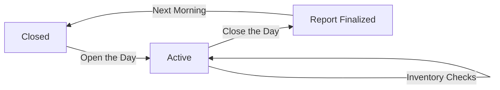

# 📋 POS System - Production User Manual

Welcome to the comprehensive guide for our Point of Sale (POS) and Inventory Management System. This manual is designed to help you master every aspect of your business operations.

---

## 🏗️ 1. Core Concepts & Lifecycle

The system operates on a structured lifecycle to ensure data integrity and financial accuracy.

### Business Day Lifecycle

> [!IMPORTANT]
> The **Business Day** must be **OPEN** before the system allows any Terminal sales or high-impact inventory movements.

---

## 🚀 2. Getting Started: Onboarding & Login

### First-Time Setup (Onboarding)
If you are a new business owner:
1.  **Select Industry**: Choose the template that best matches your business (e.g., Restaurant, Retail, Pharmacy). This sets up your default icons and modules.
2.  **Define Identity**: Enter your Business Name and Admin credentials.
3.  **Automatic Provisioning**: The system will automatically create your **Main Warehouse** and your **Chart of Accounts**.

### Secure Login
- **URL**: `http://localhost:3000`
- **Credentials**: Use your email and the secure password created during onboarding.
- **Roles**: Your interface will dynamically change based on your role (Admin, Manager, or Cashier).

---

## 🏦 3. Business Day Control

### Opening the Day
- **What**: Signals that the store is ready for business.
- **How**: Click **"OPEN THE DAY"** on the dashboard.
- **Security**: Requires an **Operation Key**. If you are a cashier, ask your manager for a key.

### Closing the Day
- **What**: Locks the terminal and finalizes financial records for the day.
- **How**: Click **"Close Day"** in the sidebar.
- **Why**: Ensures that no unauthorized sales happen after hours and triggers the final journal synchronization.

---

## 📦 4. Master Data: Catalog Management

### Adding Products
- **What**: Registering items you want to sell.
- **How**: Navigate to **Master Data** -> **Add Item**.
- **Fields**:
    - **Item Type**: Choose **PRODUCT** for physical goods (stock tracked) or **SERVICE** for labor (no stock).
    - **Base Price**: The price shown to the customer.
    - **Cost Price**: Your purchase price (used for profit calculation).

> [!TIP]
> Use high-quality barcodes/SKUs in the **Code** field to enable lightning-fast lookups in the Terminal.

---

## 📊 5. Inventory: Warehouse Operations

### Stock Adjustments
- **What**: Manually correcting stock levels due to breakage, theft, or donation.
- **How**: 
    1. Go to **Inventory**.
    2. Click **Adjust** on a specific item.
    3. Select **Stock IN** (add) or **Stock OUT** (remove).
    4. **Reason**: Always provide a clear reason for audit purposes.

### Batch & Expiry (Industry Specific)
For **Pharmacy** or **Food** industries:
- Each "Stock IN" movement tracks the **Batch Number** and **Expiry Date**.
- The system will alert you when items are nearing expiration.

---

## 🛒 6. Terminal: The Pulse of Sales

### Making a Sale
- **What**: The primary interface for your cashiers.
- **How**:
    1. **Search**: Type name or scan barcode.
    2. **Cart**: Adjust quantities inside the cart sidebar.
    3. **Checkout**: Click the large button to choose a payment method.
- **Payments**: Supports **Cash**, **Card**, and **Digital Wallets**.

### Returns & Refunds
- **What**: Handing back money to customers for returned goods.
- **How**: 
    1. Navigate to the **Returns** tab inside the Terminal.
    2. Search by **Invoice Number**.
    3. Select items and process the refund.
- **System Action**: Stock is automatically moved back into the warehouse and journal entries are reversed.

---

## 💰 7. Accounting & Financial Integrity

Every action you take (Sale, Purchase, Return) is recorded in your **General Ledger**.
- **Journal Entries**: A list of every debit and credit transaction.
- **Chart of Accounts**: A summary of your "Cash on Hand", "Sales Revenue", and "Tax Payable".

> [!NOTE]
> All accounting is **automated**. You don't need to be an accountant to use this system, but your accountant will love the data it generates.

---

## 👥 8. Team & Security

### Managing Staff
- **Add Member**: Create accounts for your cashiers and managers.
- **Roles**:
    - **Admin**: Full control over settings and data.
    - **Cashier**: Restricted to the Terminal and basic product view.

### Security Keys
For highly sensitive actions (like approving a $500 stock adjustment or opening the day):
1.  An Admin generates a **Key**.
2.  The User enters the Key to "Approve" the action.
3.  The system logs exactly who authorized the action and when.

---

## 📈 9. Reporting & Insights

The **Overview** dashboard provides real-time data:
- **Sales Trends**: Which hours are your busiest?
- **Top Items**: What's flying off the shelves?
- **Financial Health**: Compare your Revenue vs. Costs.

---

## ⚙️ 10. System Settings

### Look & Feel
- **Theming**: Choose from 25+ curated palettes (e.g., "Midnight", "Forest", "Modern Office").
- **Dark Mode**: Reduces eye strain for late-night shifts.

---

© 2025 MS Tech Systems. Full-service POS Solutions.
